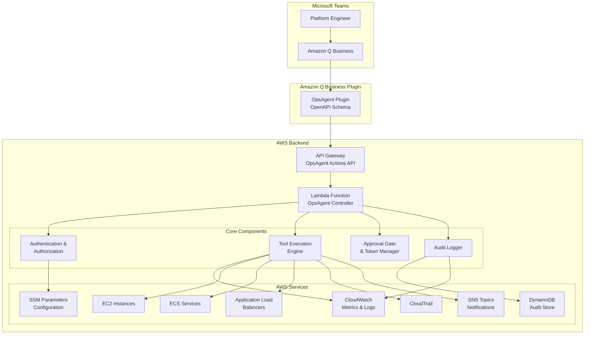

# Design Document: OpsAgent Actions for Amazon Q Business

## Overview

OpsAgent Actions is a serverless AWS operations assistant that integrates with Amazon Q Business through a custom plugin. The system enables platform engineers to perform secure, auditable AWS operations directly from Microsoft Teams using Amazon Q Business as the interface.

**Key Design Principles:**
- **Plugin-First**: Amazon Q Business handles the chat interface; our system provides the operational backend
- **Approval-Required**: All write operations require explicit user approval via token-based workflow
- **Tag-Scoped**: Write operations restricted to resources tagged `OpsAgentManaged=true`
- **Audit-First**: Complete audit trail for all operational actions
- **Mode-Aware**: Support for mock, dry-run, and live execution modes

## Architecture

### High-Level Architecture



### Component Responsibilities

#### Amazon Q Business Plugin
- **Purpose**: Expose OpsAgent operations as callable actions within Amazon Q Business
- **Implementation**: OpenAPI 3.0 schema defining available operations
- **Operations**:
  - `get_ec2_status`: Get EC2 instance status by instance ID or tag filter
  - `get_cloudwatch_metrics`: Retrieve CloudWatch metrics with time windows
  - `describe_alb_target_health`: Check ALB/Target Group health status
  - `search_cloudtrail_events`: Search CloudTrail events with filters
  - `propose_action`: Create approval token for write operations
  - `approve_action`: Execute approved action with token
  - `create_incident_record`: Create incident record for workflow management
  - `post_summary_to_channel`: Post operational summary to Teams channel

#### OpsAgent Controller (Lambda)
- **Purpose**: Core business logic for secure AWS operations
- **Responsibilities**:
  - Validate incoming requests from Amazon Q Business plugin
  - Execute read-only diagnostic operations immediately
  - Create approval tokens for write operations
  - Validate approval tokens and execute approved actions
  - Generate comprehensive audit logs
  - Enforce tag-based resource scoping

#### Tool Execution Engine
- **Purpose**: Safe execution of AWS operations with proper guardrails
- **Features**:
  - Allow-listed operations only
  - Parameter validation and sanitization
  - Execution mode enforcement (mock/dry-run/live)
  - Resource tag validation for write operations
  - Structured error handling and reporting

#### Approval Gate & Token Manager
- **Purpose**: Secure approval workflow for write operations
- **Features**:
  - Generate short-lived approval tokens (15-minute expiry)
  - Token-to-action binding (prevents token reuse for different actions)
  - User authorization validation
  - One-time token consumption
  - Approval decision audit trail

## OpenAPI Schema Structure

The Amazon Q Business plugin is defined by an OpenAPI 3.0 schema that exposes all 8 operations:

### Schema Overview
```yaml
openapi: 3.0.0
info:
  title: OpsAgent Actions API
  version: 1.0.0
  description: Secure AWS operations for platform engineers via Amazon Q Business

paths:
  /operations/diagnostic:
    post:
      summary: Execute diagnostic operations
      operationId: executeDiagnostic
      
  /operations/propose:
    post:
      summary: Propose write action for approval
      operationId: proposeAction
      
  /operations/approve:
    post:
      summary: Execute approved action
      operationId: approveAction
      
  /operations/workflow:
    post:
      summary: Execute workflow operations
      operationId: executeWorkflow
```

### Operation Categories
- **Diagnostic Operations**: `get_ec2_status`, `get_cloudwatch_metrics`, `describe_alb_target_health`, `search_cloudtrail_events`
- **Write Operations**: `reboot_ec2`, `scale_ecs_service` (require approval)
- **Workflow Operations**: `create_incident_record`, `post_summary_to_channel`

## Data Models

### Plugin Request/Response Schema

#### Diagnostic Request
```json
{
  "operation": "get_ec2_status",
  "parameters": {
    "instance_id": "i-1234567890abcdef0",
    "metrics": ["cpu", "memory", "network"],
    "time_window": "15m"
  },
  "user_context": {
    "user_id": "user@company.com",
    "teams_tenant": "company.onmicrosoft.com"
  }
}
```

#### Diagnostic Response
```json
{
  "success": true,
  "summary": "Instance i-123 is healthy. CPU: 25%, Memory: 60%, Network: normal",
  "details": {
    "instance_state": "running",
    "cpu_utilization": 25.3,
    "memory_utilization": 60.1,
    "network_in": "1.2 MB/s",
    "network_out": "0.8 MB/s"
  },
  "execution_mode": "SANDBOX_LIVE",
  "correlation_id": "req-uuid-123"
}
```

#### Write Operation Request
```json
{
  "operation": "propose_action",
  "parameters": {
    "action": "reboot_ec2",
    "instance_id": "i-1234567890abcdef0",
    "reason": "High CPU utilization, unresponsive to SSH"
  },
  "user_context": {
    "user_id": "user@company.com",
    "teams_tenant": "company.onmicrosoft.com"
  }
}
```

#### Write Operation Response
```json
{
  "success": true,
  "approval_required": true,
  "approval_token": "approve-abc123def456",
  "expires_at": "2024-01-15T10:30:00Z",
  "action_summary": "Reboot EC2 instance i-1234567890abcdef0",
  "risk_level": "medium",
  "instructions": "To proceed, use: approve_action with token 'approve-abc123def456'",
  "correlation_id": "req-uuid-124"
}
```

#### Workflow Operation Request
```json
{
  "operation": "create_incident_record",
  "parameters": {
    "summary": "High CPU utilization on production instances",
    "severity": "medium",
    "links": [
      "https://console.aws.amazon.com/ec2/v2/home#Instances:instanceId=i-1234567890abcdef0",
      "https://monitoring.company.com/dashboard/ec2"
    ]
  },
  "user_context": {
    "user_id": "user@company.com",
    "teams_tenant": "company.onmicrosoft.com"
  }
}
```

#### Workflow Operation Response
```json
{
  "success": true,
  "incident_id": "INC-2024-001234",
  "created_at": "2024-01-15T10:15:00Z",
  "notification_sent": true,
  "correlation_id": "req-uuid-125"
}
```

### Internal Data Models

#### Tool Call
```python
@dataclass
class ToolCall:
    tool_name: str
    args: Dict[str, Any]
    requires_approval: bool
    correlation_id: str
    user_id: str
    timestamp: datetime
```

#### Approval Token
```python
@dataclass
class ApprovalToken:
    token: str
    expires_at: datetime
    user_id: str
    tool_call: ToolCall
    risk_level: str
    consumed: bool = False
```

#### Audit Entry
```python
@dataclass
class AuditEntry:
    correlation_id: str
    user_id: str
    timestamp: datetime
    operation: str
    parameters: Dict[str, Any]  # Sanitized
    result: Dict[str, Any]
    execution_mode: str
    success: bool
    error_message: Optional[str] = None
```

#### Incident Record
```python
@dataclass
class IncidentRecord:
    incident_id: str
    summary: str
    severity: str
    links: List[str]
    created_by: str
    created_at: datetime
    status: str = "open"
    correlation_id: str
```

#### Workflow Operation
```python
@dataclass
class WorkflowOperation:
    operation_type: str  # "incident" or "notification"
    parameters: Dict[str, Any]
    user_id: str
    correlation_id: str
    timestamp: datetime
```

## Security Model

### Authentication & Authorization Flow

1. **Amazon Q Business Authentication**: User authenticated via Microsoft 365/Teams
2. **Plugin Authorization**: Amazon Q Business validates plugin access
3. **Backend Authorization**: OpsAgent Controller validates user against allow-list
4. **Resource Authorization**: Tag-based scoping for write operations

### Security Controls

#### Input Validation
- All plugin parameters validated against JSON schema
- SQL injection and command injection prevention
- Parameter sanitization for audit logs

#### Resource Scoping
- Write operations only on resources tagged `OpsAgentManaged=true`
- Read operations allowed on all accessible resources
- Cross-account operations blocked (single account scope)

#### Approval Workflow Security
- Tokens cryptographically signed and time-limited (15 minutes)
- One-time use tokens (consumed after execution)
- User identity validation on approval
- Action parameter binding (token tied to specific action)

#### Audit Security
- All operations logged before execution
- Sensitive data sanitized in logs
- Correlation IDs for request tracing
- Immutable audit trail in DynamoDB

### Threat Model

#### Threats Mitigated
- **Unauthorized Operations**: User allow-list and resource tagging
- **Privilege Escalation**: Least-privilege IAM roles
- **Token Replay**: One-time use tokens with expiration
- **Parameter Tampering**: Cryptographic token binding
- **Data Exfiltration**: Read-only operations don't expose sensitive data
- **Audit Tampering**: Immutable DynamoDB audit store

#### Residual Risks
- **Social Engineering**: Users could be tricked into approving malicious actions
- **Insider Threat**: Authorized users could misuse legitimate access
- **Plugin Compromise**: If Amazon Q Business plugin is compromised

## Tool Catalog

### Read-Only Diagnostic Operations (No Approval Required)

#### `get_ec2_status`
- **Purpose**: Get EC2 instance status and basic metrics by instance ID or tag filter
- **Parameters**: `instance_id` OR `tag_filter`, `metrics[]`, `time_window`
- **AWS APIs**: `ec2:DescribeInstances`, `cloudwatch:GetMetricStatistics`
- **Output**: Instance state, CPU/memory/network metrics, health status

#### `get_cloudwatch_metrics`
- **Purpose**: Retrieve CloudWatch metrics for resources with time windows
- **Parameters**: `resource`, `metric`, `window`, `namespace`, `dimensions`
- **AWS APIs**: `cloudwatch:GetMetricStatistics`, `cloudwatch:ListMetrics`
- **Output**: Metric values, statistics, and trend analysis

#### `describe_alb_target_health`
- **Purpose**: Check ALB/Target Group health status
- **Parameters**: `alb_arn` OR `target_group_arn`
- **AWS APIs**: `elbv2:DescribeTargetHealth`, `elbv2:DescribeLoadBalancers`
- **Output**: Target health status, unhealthy targets, load balancer state

#### `search_cloudtrail_events`
- **Purpose**: Search CloudTrail events with filters and time windows
- **Parameters**: `filter`, `window`, `event_name`, `resource_name`
- **AWS APIs**: `cloudtrail:LookupEvents`
- **Output**: Filtered CloudTrail events with timestamps and details

### Write Operations (Approval Required)

#### `reboot_ec2`
- **Purpose**: Reboot an EC2 instance
- **Parameters**: `instance_id`, `reason`
- **AWS APIs**: `ec2:RebootInstances`
- **Validation**: Must have `OpsAgentManaged=true` tag
- **Output**: Reboot status and confirmation

#### `scale_ecs_service`
- **Purpose**: Scale ECS service desired count
- **Parameters**: `cluster`, `service`, `desired_count`
- **AWS APIs**: `ecs:UpdateService`, `ecs:DescribeServices`
- **Validation**: Must have `OpsAgentManaged=true` tag
- **Output**: Scaling status and new desired count

### Workflow Operations (No Approval Required, Fully Audited)

#### `create_incident_record`
- **Purpose**: Create incident record for workflow management
- **Parameters**: `summary`, `severity`, `links[]`
- **AWS APIs**: DynamoDB write, SNS publish
- **Output**: Incident ID, creation timestamp, notification status

#### `post_summary_to_channel`
- **Purpose**: Post operational summary to Teams channel or webhook
- **Parameters**: `text`, `channel_id` OR `webhook_url`
- **AWS APIs**: SNS publish, HTTP webhook call
- **Output**: Message delivery status and timestamp

## Execution Modes

### LOCAL_MOCK
- **Purpose**: Development and unit testing
- **Behavior**: 
  - No AWS API calls made
  - Deterministic mock responses
  - All operations return success
- **Use Cases**: Local development, CI/CD testing

### DRY_RUN
- **Purpose**: Integration testing and demos
- **Behavior**:
  - Read operations execute normally
  - Write operations return "WOULD_EXECUTE" without changes
  - Real AWS connectivity required for reads
- **Use Cases**: Integration testing, customer demos

### SANDBOX_LIVE
- **Purpose**: Full end-to-end testing
- **Behavior**:
  - All operations execute normally
  - Write operations restricted to tagged resources
  - Full audit logging enabled
- **Use Cases**: Pre-production validation, sandbox environments

## Error Handling

### Error Categories

1. **Authentication Errors**: Invalid user, unauthorized access
2. **Validation Errors**: Invalid parameters, malformed requests
3. **Authorization Errors**: Insufficient permissions, untagged resources
4. **AWS API Errors**: Service unavailable, rate limiting, permission denied
5. **System Errors**: Database unavailable, configuration errors

### Error Response Format

```json
{
  "success": false,
  "error": {
    "code": "VALIDATION_ERROR",
    "message": "Instance ID must be in format i-xxxxxxxxxxxxxxxxx",
    "correlation_id": "req-uuid-125",
    "retry_after": null
  }
}
```

### Retry Strategy

- **Transient Errors**: Exponential backoff (max 3 retries)
- **Rate Limiting**: Respect AWS API retry-after headers
- **Fatal Errors**: No retry, immediate failure response

## Deployment Architecture

### AWS Resources

#### Core Infrastructure
- **API Gateway**: RESTful API with OpenAPI schema
- **Lambda Function**: Python 3.11 runtime, 512MB memory, 30s timeout
- **IAM Role**: Least-privilege permissions for required AWS services
- **CloudWatch Logs**: Structured logging with retention policy

#### Data Storage
- **DynamoDB Tables**: 
  - Audit log storage with TTL
  - Incident records with GSI for querying
- **SSM Parameters**: Configuration and user allow-lists
- **Secrets Manager**: Sensitive configuration (if needed)

#### Monitoring & Alerting
- **CloudWatch Metrics**: Lambda performance and error rates
- **CloudWatch Alarms**: High error rates, long execution times
- **X-Ray Tracing**: Request tracing and performance analysis

### Infrastructure as Code

```yaml
# SAM Template Structure
AWSTemplateFormatVersion: '2010-09-09'
Transform: AWS::Serverless-2016-10-31

Parameters:
  Environment: [sandbox, staging, production]
  ExecutionMode: [LOCAL_MOCK, DRY_RUN, SANDBOX_LIVE]
  
Resources:
  OpsAgentApi:
    Type: AWS::Serverless::Api
    Properties:
      DefinitionBody: # OpenAPI 3.0 schema
      
  OpsAgentFunction:
    Type: AWS::Serverless::Function
    Properties:
      Runtime: python3.11
      Handler: main.lambda_handler
      Environment:
        Variables:
          EXECUTION_MODE: !Ref ExecutionMode
          
  AuditTable:
    Type: AWS::DynamoDB::Table
    Properties:
      BillingMode: PAY_PER_REQUEST
      TimeToLiveSpecification:
        AttributeName: ttl
        Enabled: true
        
  IncidentTable:
    Type: AWS::DynamoDB::Table
    Properties:
      BillingMode: PAY_PER_REQUEST
      GlobalSecondaryIndexes:
        - IndexName: severity-created-index
          KeySchema:
            - AttributeName: severity
              KeyType: HASH
            - AttributeName: created_at
              KeyType: RANGE
          Projection:
            ProjectionType: ALL
            
  NotificationTopic:
    Type: AWS::SNS::Topic
    Properties:
      DisplayName: OpsAgent Notifications
```

## Testing Strategy

### Unit Testing
- **Tool Execution**: Mock AWS APIs, test business logic
- **Approval Workflow**: Token generation, validation, expiration
- **Security Controls**: Input validation, authorization checks
- **Error Handling**: All error conditions and edge cases

### Integration Testing
- **API Gateway**: End-to-end request/response flow
- **AWS Services**: Real AWS API calls in DRY_RUN mode
- **Database**: DynamoDB operations and audit logging
- **Authentication**: User validation and authorization

### Property-Based Testing
- **Security Properties**: "Write operations never execute without approval"
- **Audit Properties**: "All operations generate audit entries"
- **Scoping Properties**: "Write operations only on tagged resources"

## Correctness Properties

The system implements the following correctness properties validated through property-based testing:

### Property 1: Authentication Validation
**Statement**: All operations must have valid user authentication
**Validation**: Every request must include valid user context from Amazon Q Business

### Property 2: Tag Scoping Enforcement
**Statement**: Write operations only execute on resources tagged `OpsAgentManaged=true`
**Validation**: All write operations validate resource tags before execution

### Property 3: Mode Consistency
**Statement**: System behavior is consistent within each execution mode
**Validation**: Operations return predictable results based on execution mode

### Property 4: Read-Only Guarantee
**Statement**: Diagnostic operations never modify AWS resources
**Validation**: Read-only operations use only describe/list/get AWS APIs

### Property 5: Approval Enforcement
**Statement**: Write operations require valid approval tokens
**Validation**: No write operation executes without token validation

### Property 6: Audit Completeness
**Statement**: All operations generate audit entries
**Validation**: Every operation creates corresponding audit log entry

### Property 7: Secret Hygiene
**Statement**: Sensitive data is never logged in plain text
**Validation**: Audit logs contain sanitized parameters only

### Property 8: Plugin Response Format
**Statement**: All responses conform to OpenAPI schema
**Validation**: Response structure matches defined schema

### End-to-End Testing
- **Amazon Q Business Integration**: Plugin calls and responses
- **Teams Integration**: Full user workflow in Teams
- **Approval Workflow**: Complete propose/approve/execute cycle

## Monitoring and Observability

### Key Metrics
- **Request Volume**: Operations per minute/hour
- **Success Rate**: Percentage of successful operations
- **Approval Rate**: Percentage of approvals vs. denials
- **Execution Time**: P50, P95, P99 latencies
- **Error Rate**: Errors by category and operation

### Alerting
- **High Error Rate**: >5% errors in 5-minute window
- **Long Execution Time**: >10s execution time
- **Authentication Failures**: >10 auth failures in 1 minute
- **Unauthorized Access**: Any unauthorized access attempts

### Dashboards
- **Operational Dashboard**: Request volume, success rates, latencies
- **Security Dashboard**: Authentication events, authorization failures
- **Audit Dashboard**: Operation history, user activity, compliance metrics

## Compliance and Governance

### Audit Requirements
- **Retention**: 90 days minimum for audit logs
- **Immutability**: Audit entries cannot be modified after creation
- **Completeness**: All operations must generate audit entries
- **Traceability**: Correlation IDs link related operations

### Access Control
- **User Allow-List**: Maintained in SSM Parameter Store
- **Resource Tagging**: `OpsAgentManaged=true` required for write operations
- **Least Privilege**: IAM roles with minimal required permissions
- **Regular Review**: Quarterly access review and cleanup

### Change Management
- **Approval Required**: All infrastructure changes require approval
- **Testing Required**: All changes must pass full test suite
- **Rollback Plan**: Automated rollback for failed deployments
- **Documentation**: All changes documented with rationale